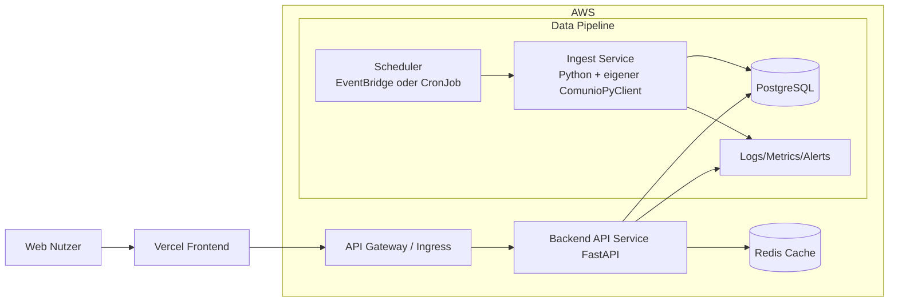

# Zielarchitektur fuer das Comunio-Projekt

## 1. Kontext und Leitplanken
Diese Architektur basiert auf dem Lastenheft und der Projektdokumentation mit folgenden festen Vorgaben:

- Datenquelle fuer Comunio-Daten: Comunio-REST-API, angesprochen ueber den eigenen `ComunioPyClient`-Adapter
- Architektur: Microservices, REST-Schnittstellen
- Plattform: AWS fuer Backend und Datenbank, Vercel fuer Frontend
- Betrieb: containerisiert mit Docker und orchestriert in Kubernetes
- Nicht-funktional: unter 2 Sekunden Ladezeit, 99.9 Prozent Verfuegbarkeit, OWASP Top 10 Schutz, Monitoring und Alerting

## 2. Architekturueberblick

## 3. Service-Schnitt

### 3.1 Ingest Service
- Verantwortung:
  - Login und Datenabruf ueber den eigenen `ComunioPyClient` gegen die Comunio-REST-API
  - Snapshot-Erzeugung fuer Marktwerte, Transfermarkt und Punktedaten
  - Idempotentes Schreiben in die Datenbank
- Trigger:
  - Stufe 1 manuell
  - ab Stufe 2 taeglich geplant (z. B. 06:00 UTC)
- AP-9-Betrieb: EventBridge startet den ECS-Fargate-Task taeglich um 06:00 UTC mit `run_type=scheduled`.
- AP-9-Resilienz: EventBridge verwendet zwei Retries innerhalb einer Stunde; danach wird das Ereignis in der verschluesselten SQS-DLQ abgelegt.
- Fehlerbehandlung:
  - Retry mit Exponential Backoff
  - Circuit-Breaker fuer externe API-Fehler
  - Alert bei wiederholtem Fehler oder leerem Snapshot

### 3.1.1 AP-9 Scheduler-Betriebsvertrag
- Die aktive Rule `comunio-prod-snapshot-schedule` verwendet die freigegebene Cron-Konfiguration und startet genau einen Fargate-Task pro Ausfuehrung.
- Der Task nutzt eine gepinnte Fargate-Plattformversion und schreibt `run_started`, `db_verify` sowie `run_success` oder `run_failed` in CloudWatch.
- Fachliche Idempotenz bleibt ueber die bestehenden Snapshot-Constraints erhalten; ein erneuter Lauf darf keine doppelten Marktwertzeilen erzeugen.
- Eine Aktivierung gilt erst nach drei aufeinanderfolgenden erfolgreichen Scheduler-Fenstern als stabiler AP-9-Nachweis.

### 3.2 Backend API Service (FastAPI)
- Verantwortung:
  - REST-Endpunkte fuer Frontend und spaetere Integrationen
  - Aggregationen und Delta-Berechnungen
  - Optional Authentifizierung und Rollenmodell
- Beispiel-Endpunkte:
  - GET /players
  - GET /players/{id}/history
  - GET /teams
  - GET /transfermarket
  - GET /rankings

### 3.3 Frontend Service (React auf Vercel)
- Verantwortung:
  - Dashboard, Team- und Spieleransichten
  - Historische Visualisierung von Marktwerten
  - Filter, Suche, Sortierung und Vergleich
- Performance:
  - statische Assets via CDN
  - API-Responses gecached und pagination-faehig

### 3.4 Datenbank Service (PostgreSQL)
- Verantwortung:
  - Persistenz aller Stammdaten, Snapshots und Event-Historien
  - Konsistente Historisierung fuer Delta-Berechnungen
- Optional:
  - TimescaleDB fuer grosse Zeitreihenvolumen

### 3.5 Observability Service
- Logging: strukturierte Logs (JSON)
- Metrics: Latenz, Fehlerquote, Snapshot-Volumen, API Throughput
- Alerts:
  - Ingest-Job fehlgeschlagen
  - keine neuen Daten innerhalb Intervall
  - API Fehlerquote ueber Schwellwert

## 4. Datenfluss

1. Scheduler startet Ingest-Run.
2. Ingest ruft Daten ueber den `ComunioPyClient` aus der Comunio-REST-API ab.
3. Daten werden validiert, normalisiert und idempotent gespeichert.
4. API liest normalisierte Daten und liefert aggregierte Antworten.
5. Frontend visualisiert die Daten und aktualisiert Dashboards.

## 5. Sicherheitsarchitektur

- Transportverschluesselung: TLS durchgaengig
- Secrets: nur ueber Secret-Store, niemals im Code
- API-Schutz:
  - Rate Limiting
  - Input-Validierung
  - Security Header
- Zugriffsschutz:
  - Rollen- und Rechtekonzept fuer Admin und User
  - Least-Privilege IAM fuer AWS-Rollen
- OWASP Top 10 Massnahmen:
  - zentrale Abhaengigkeits-Scans
  - sichere Session- und Token-Verwaltung
  - Schutz vor Injection und Broken Access Control

### 5.1 Production Security Gates (verbindlich)
- Gate S1 Credentials: In `prod` und `production` sind nur AWS Secrets Manager Credentials zulaessig. ENV-Fallback ist in Produktion verboten.
- Gate S2 DB Transport: Datenbankverbindungen muessen TLS mit `sslmode=require` oder staerker erzwingen, Zielprofil `verify-full`.
- Gate S3 Logging: Lauf- und Fehlerlogs muessen strukturiert sein (`event`, `stage`, `run_id`, `error_code`) und duerfen keine rohen Exception-Details enthalten.
- Gate S4 Snapshot Input: Lokale Snapshot-Dateien sind nur innerhalb eines erlaubten Basisverzeichnisses und unter einem Groessenlimit zulaessig.
- Gate-Policy: Bei Verstoessen gegen S1-S4 ist ein Production-Deploy blockiert.

### 5.2 Terraform-State und Secret-Lifecycle
- Terraform-State darf nicht in Git oder auf unverschluesselten lokalen Arbeitsplaetzen liegen.
- Das Produktions-Backend verwendet ein versioniertes, verschluesseltes S3-Backend mit aktivierter Public-Access-Sperre und State-Locking.
- Der State-Zugriff erfolgt nur ueber einen dedizierten Deployment-Principal mit minimalen S3- und Locking-Rechten.
- Bereits exponierte State-, Backup- und Variablendateien werden aus der Versionshistorie entfernt; betroffene RDS-, Datenbank-URL- und Comunio-Credentials werden vor dem naechsten Produktionslauf rotiert.
- RDS- und Comunio-Secrets erhalten einen dokumentierten Rotationsprozess. Automatische Rotation wird erst aktiviert, wenn der Rotationshandler inklusive Reconnect-Test produktionsreif ist.
- Secret-Werte, Secret-Versionen und Rotationsdetails werden nicht im fachlichen Datenmodell gespeichert. CloudTrail und Secrets Manager liefern den technischen Audit-Trail.

### 5.3 Logging-Sanitization und Diagnose
- Standardlogs enthalten nur `event`, `stage`, `run_id`, `correlation_id`, `error_code` und eine kurze, sanitizte Diagnose.
- Rohe Exception-Texte, Connection Strings, Tokens, Secret-Namen, E-Mail-Adressen und lokale Pfade werden nicht geloggt.
- Tiefere Diagnose erfolgt ueber geschuetzte AWS-Diagnosekanaele mit eingeschraenktem Zugriff und definierter Aufbewahrung.

## 6. Verfuegbarkeit und Skalierung

- Ziel: 99.9 Prozent Uptime
- Horizontal skalierbare API Pods in Kubernetes
- Read-Optimierung ueber Redis und DB-Indizes
- Entkopplung Ingest und API, damit Lastspitzen den Live-Zugriff nicht blockieren
- Rollierende Deployments ohne Downtime

## 7. Performance-Strategie

- API-Ziel: P95 Antwortzeit unter 500 ms fuer Standard-Queries
- Endnutzer-Ziel: Seitenladezeit unter 2 Sekunden
- Massnahmen:
  - Query-Optimierung und Composite-Indizes
  - Ergebnis-Caching fuer haeufige Rankings und Historien
  - Pagination und begrenzte Payload-Groessen

## 8. Release-Stufen (aus Lastenheft abgeleitet)

1. Manueller Abruf: kontrollierter Testlauf und Datenvalidierung
2. Taeglicher Abruf: automatische, idempotente Snapshot-Jobs
3. Backend-API: stabile REST-Schicht
4. Minimal-Frontend: Basis-Dashboard
5. Frontend-Ausbau: Usability, Vergleiche, Detailansichten
6. Features: Alerts und Prognosen
7. Skalierung: Lasttests, Caching, horizontale Skalierung
8. Security: DSGVO-Readiness und Security Hardening
9. CI/CD: Build-, Test- und Deployment-Automatisierung

## 9. Architekturentscheidungen

- Ein eigener Comunio-REST-Adapter reduziert Integrationsrisiko und verbessert Wartbarkeit.
- Snapshot-Modell ermoeglicht reproduzierbare Historie und robuste Delta-Berechnung.
- Microservice-Schnitt zwischen Ingest und API verbessert Skalierbarkeit und Ausfallsicherheit.
- Vercel fuer Frontend beschleunigt Deployment und globale Auslieferung.

## 10. Konsolidierte Architektur-Entscheidungen aus Multi-Agent-Review

### 10.1 Verbindliche AWS-Bausteine
- Secrets Management: AWS Secrets Manager mit Rotation alle 30 bis 90 Tage.
- Datenbank-HA: RDS PostgreSQL Multi-AZ mit automatischem Failover als Zielprofil; MVP bleibt bis zum Reliability-Gate budgetschonend.
- Netzwerk: VPC mit Private Subnets fuer RDS und restriktiven Security Groups; der aktuelle Ingest laeuft auf ECS Fargate.
- Task-Berechtigungen: Dedizierte ECS Task Roles pro Service mit Least-Privilege statt gemeinsam genutzter Admin-Rechte.
- Schutzschicht: AWS WAF vor API-Einstieg inklusive Rate Limiting.
- Audit: CloudTrail und VPC Flow Logs aktivieren.

### 10.2 Skalierungsgates

| Gate | Trigger | Aktion |
|------|---------|--------|
| MVP zu Growth | API P95 unter 500 ms fuer 7 Tage und Fehlerquote unter 0.1 Prozent | Frontend-Ausbau starten |
| Growth zu Scale | Snapshot-Volumen ueber 100000 pro Tag oder DAU ueber 100 | Read-Replica, erweiterte Cache-Strategie und DB-Partitionierung aktivieren |
| Scale zu Enterprise | DAU ueber 1000 und Compliance-Checks gruen | Multi-Region-Option und DR-Runbook erweitern |

Ergaenzende Security- und Cost-Gates:
- Security-Gate vor jedem Deploy: Keine offenen Critical/High Findings und S1-S4 gruene Checks.
- Cost-Gate MVP: Budget-Warnungen bei 50/80/100 Prozent fuer Dev und Staging aktiv.
- Cost-Gate Growth: 100 Prozent Tag-Compliance (`Environment`, `Owner`, `Project`, `CostCenter`) und monatlicher Rightsizing-Review.

### 10.3 Resilienzparameter
- Ingest-Retry: Exponential Backoff 2s, 4s, 8s, 16s (maximal 4 Versuche).
- Circuit Breaker: Open State nach 5 aufeinanderfolgenden Fehlern fuer 60 Sekunden.
- Degraded Mode: API liefert im Stoerfall letzte valide Cache-Antwort mit Kennzeichnung.
- Alerting-Schwellen:
  - API Fehlerquote ueber 1 Prozent: Warnung.
  - API Fehlerquote ueber 5 Prozent: kritischer Alarm.
  - Ingest-Job ohne neue Daten im Intervall: kritischer Alarm.

  ## 11. Phase-1 Baseline (Analyse und Setup, Woche 1-2)

  Diese Festlegungen gelten nur fuer Phase 1 und bilden die Startbasis fuer die Umsetzung.

  ### 11.1 Verbindliche P1-Entscheidungen
  - Scheduler-Optionen dokumentiert, finale Auswahl in Phase 1 getroffen (EventBridge/Lambda oder CronJob).
  - Datenbank-Hosting verbindlich festgelegt (RDS PostgreSQL als Zielbild).
  - Secrets-Management verbindlich festgelegt (AWS Secrets Manager, keine Secrets im Repo).
  - Netzwerk-Baseline festgelegt (VPC, private DB-Zone, restriktive Security Groups).
  - CI/CD-Baseline definiert (Build, Lint, Tests, Artefakt-Strategie).

  ### 11.2 Minimales AWS-Setup fuer Phase 1
  - Account-/Umgebungsmodell: Dev, optional Staging als naechster Schritt.
  - Monitoring-Baseline: CloudWatch Logs/Metrics, erste Alarme fuer Ingest-Fehler und API-Health.
  - Kostenkontrolle: Budget-Warnung fuer Dev-Umgebung aktiv.
  - IAM-Baseline: Least Privilege Rollen fuer Ingest und API festgelegt.
  - Security-Baseline: Secrets-Manager-only in Produktion, DB-TLS-Policy und strukturierte sanitizte Logs als Pflicht.

  ### 11.3 Trade-offs (nur Phase 1)
  - Einfaches Setup vor Vollausbau: Fokus auf schnelle, reproduzierbare Startfaehigkeit statt Vollautomatisierung.
  - Security-Baseline sofort, tiefe Härtung spaeter: Secrets/IAM jetzt verbindlich, erweiterte Security-Kontrollen in spaeteren Phasen.
  - Kosten zuerst kontrollieren statt maximaler Redundanz: frueh budgetschonend planen, HA-Ausbau folgt im vorgesehenen Fahrplan.

  ### 11.4 Offene Entscheidungen aus Phase 1
  - Exakte Runtime fuer Ingest in Produktion (Lambda/EventBridge vs. Container/Cron).
  - Detailtiefe der API-Perimeter-Security im fruehen Betrieb (WAF-Regelsatz initial).
  - Zeitpunkt fuer Redis-Einsatz als Pflichtbestandteil (ab Last-/Latenz-Metriken).

  ## 12. Phase-2 Fokus: AP-5 und AP-6

  Dieser Abschnitt gilt nur fuer die aktuelle Umsetzung von AP-5 und AP-6.

  ### 12.1 AP-5 Comunio-REST-Adapter und Login-Flow
  - Ingest-Bootstrap ist als separates Backend-Modul umgesetzt.
  - Credentials werden priorisiert aus AWS Secrets Manager geladen; lokale ENV-Werte sind nur Fallback.
  - Login-Flow ist auf Session-Validierung begrenzt und endet bewusst vor Snapshot-Verarbeitung.
  - Fehlerbehandlung fuer Login ist explizit vorhanden und beendet den Lauf mit Status failed.

  ### 12.2 AP-6 Tabellen und Migrationen
  - Schema-Migrationen sind als versionierte SQL-Dateien umgesetzt.
  - Eine Migration-Runner-Logik fuehrt neue Migrationen einmalig aus und protokolliert sie in schema_migrations.
  - Kern-Tabellen, Zeitreihen-Tabellen und Audit/Event-Tabellen sind getrennt in drei Migrationsschritten.
  - Idempotenz wird im Schema durch UNIQUE-Constraints auf Snapshot-Tabellen abgesichert.

  ### 12.3 Scope-Grenze dieser Umsetzung
  - Nicht enthalten: automatisierter Scheduler, API-Endpunkte, Frontend-Anbindung.
  - Diese Punkte bleiben explizit in Phase 3+.

  ## 13. Phase-2 Abschluss: AP-7 und AP-8

  ### 13.1 AP-7 Manueller Snapshot-Flow
  - Runner-Modus `snapshot` fuehrt die Kette aus:
    - Login
    - Snapshot-Abruf
    - Normalisierung
    - DB-Persistenz
  - Persistenz ist in einem klaren Write-Modul gekapselt.
  - ingest_runs protokolliert jeden Lauf mit Status und Record-Zahl.

  ### 13.2 AP-8 Basis-Robustheit
  - Snapshot-Abruf nutzt Retry mit Exponential Backoff (2s, 4s, 8s).
  - Fehler werden kontrolliert propagiert und als failed-Lauf markiert.
  - Keine Scheduler-Automatisierung in Phase 2; nur manueller Trigger.

  ### 13.3 Trade-offs (Phase-2 Abschluss)
  - Der Live-Adapter bleibt von der Stabilitaet und dem Vertrag der Comunio-REST-API abhaengig; optionaler Datei-Input fuer lokale deterministische Tests ist vorgesehen.
  - Fokus liegt auf Datenkonsistenz und Nachvollziehbarkeit vor Performance-Tuning.

  ## 14. Konsolidierte Multi-Agent-Entscheidungen (Phase 2)

  ### 14.1 Priorisierte Massnahmen
  - P1: Security-Blocking Controls (Credentials-Policy, DB-TLS, Logging-Sanitization, Snapshot-Input-Haertung) verbindlich als Deploy-Gates.
  - P2: Governance und Reliability (SLO/Fehlerbudget, Incident-Runbook, Auditierbarkeit mit Korrelation).
  - P3: FinOps-Leitplanken (Tags, Budget-Alarme, Rightsizing-Zyklus) fuer kontrolliertes Wachstum.

  ### 14.2 Trade-offs und Widerspruchsaufloesung
  - Trade-off Tempo vs Sicherheit: Fruehere harte Gates verlangsamen einzelne Deploys, reduzieren aber signifikant Produktions- und Compliance-Risiko.
  - Trade-off Debug-Tiefe vs Datenschutz: Sanitizte Standardlogs enthalten weniger Rohdetails; tiefe Diagnose bleibt nur in geschuetzten Kanaelen.
  - Aufgeloester Widerspruch: Kostenminimum und hohe Verfuegbarkeit werden phasengerecht kombiniert (MVP budgetschonend, HA-Ausbau erst nach Gate-Triggern).

