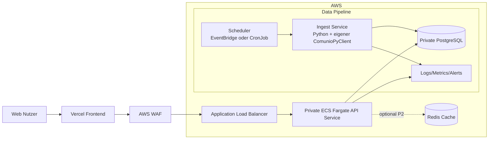

# Zielarchitektur fuer das Comunio-Projekt

## 1. Kontext und Leitplanken

Diese Architektur basiert auf dem Lastenheft und der Projektdokumentation mit folgenden festen Vorgaben:

- Datenquelle fuer Comunio-Daten: Comunio-REST-API, angesprochen ueber den eigenen `ComunioPyClient`-Adapter
- Architektur: Microservices, REST-Schnittstellen
- Plattform: AWS fuer Backend und Datenbank, Vercel fuer Frontend
- Betrieb: containerisiert mit Docker und aktuell auf AWS ECS/Fargate betrieben; Kubernetes ist keine AP-11-Voraussetzung
- Nicht-funktional: unter 2 Sekunden Ladezeit, 99.9 Prozent Verfuegbarkeit, OWASP Top 10 Schutz, Monitoring und Alerting

## 2. Architekturueberblick

## 3. Service-Schnitt

### 3.1 Ingest Service

- Verantwortung:
  - Login und Datenabruf ueber den eigenen `ComunioPyClient` gegen die Comunio-REST-API
  - Snapshot-Erzeugung fuer Marktwerte, Transfermarkt und Punktedaten
  - Idempotentes Schreiben in die Datenbank
- Trigger:
  - Stufe 1 manuell
  - ab Stufe 2 taeglich geplant (z. B. 06:00 UTC)
- AP-9-Betrieb: EventBridge startet den ECS-Fargate-Task taeglich um 06:00 UTC mit `run_type=scheduled`.
- AP-9-Resilienz: EventBridge verwendet zwei Retries innerhalb einer Stunde; danach wird das Ereignis in der verschluesselten SQS-DLQ abgelegt.
- Fehlerbehandlung:
  - Retry mit Exponential Backoff
  - Circuit-Breaker fuer externe API-Fehler
  - Alert bei wiederholtem Fehler oder leerem Snapshot

### 3.1.1 AP-9 Scheduler-Betriebsvertrag

- Die aktive Rule `comunio-prod-snapshot-schedule` verwendet die freigegebene Cron-Konfiguration und startet genau einen Fargate-Task pro Ausfuehrung.
- Der Task nutzt eine gepinnte Fargate-Plattformversion und schreibt `run_started`, `db_verify` sowie `run_success` oder `run_failed` in CloudWatch.
- Fachliche Idempotenz bleibt ueber die bestehenden Snapshot-Constraints erhalten; ein erneuter Lauf darf keine doppelten Marktwertzeilen erzeugen.
- Eine Aktivierung gilt erst nach drei aufeinanderfolgenden erfolgreichen Scheduler-Fenstern als stabiler AP-9-Nachweis. Dieser Nachweis wurde am 2026-08-31 erbracht: fuenf aufeinanderfolgende Tagesfenster (2026-08-27 bis 2026-08-31) mit `run_type=scheduled`, `run_success` und ohne Duplikate in `market_values` (siehe `implementierungsplan.md`, Abschnitt 19).

### 3.1.2 AP-9.2 Login-Retry und automatischer Erfolgs-/Fehler-Check

- Ziel: der Ingest-Task erkennt selbststaendig, ob ein Lauf erfolgreich war oder an einem Login-Problem gescheitert ist, und behandelt Login-Fehler robust, bevor der Lauf endgueltig als fehlgeschlagen gilt.
- Ablauf im Container (`backend/src/ingest/runner.py`, Funktion `_login_with_retry`):
  1. Login-Versuch 1. Bei Erfolg laeuft der Snapshot-Flow wie bisher weiter.
  1. Bei `ComunioLoginError` wartet der Prozess 5 Minuten (`COMUNIO_LOGIN_RETRY_WAIT_SECONDS`, Default 300s) und versucht den Login erneut.
  1. Nach insgesamt 3 Versuchen (`COMUNIO_LOGIN_RETRY_ATTEMPTS`, Default 3) ohne Erfolg wird der Lauf mit `run_failed`, `stage=login` beendet.
- Kein zusaetzlicher Shutdown-Schritt noetig: Der ECS-Fargate-Task ist ein einmaliger, nicht dauerhaft laufender Task (kein ECS Service). Der Container stoppt beim Prozessende automatisch identisch, egal ob der Lauf mit Exit-Code 0 (Erfolg) oder Exit-Code 1 (Login-Retries erschoepft) endet.
- Automatischer AWS-Check: Ein CloudWatch Logs Metric Filter (`login-retries-exhausted`) auf das Muster `event=run_failed stage=login` speist einen CloudWatch Alarm. Der Alarm kann optional ueber `alert_sns_topic_arn` benachrichtigen; ohne Konfiguration bleibt er sichtbar in CloudWatch, ohne zusaetzliche Kosten fuer Benachrichtigungsinfrastruktur zu erzeugen.
- Konfigurierbarkeit: `login_retry_attempts` und `login_retry_wait_seconds` sind Terraform-Variablen, die als Container-ENV `COMUNIO_LOGIN_RETRY_ATTEMPTS`/`COMUNIO_LOGIN_RETRY_WAIT_SECONDS` durchgereicht werden.
- Abgrenzung zu EventBridge-Retries: Der EventBridge-Retry (`maximum_retry_attempts=2`) greift nur, wenn der `RunTask`-API-Aufruf selbst fehlschlaegt (z. B. Kapazitaets- oder IAM-Fehler). Login-Retries sind ein separates, anwendungsinternes Verhalten innerhalb eines einzelnen Tasks.

### 3.2 Backend API Service (FastAPI)

- Verantwortung:

  - Read-only-REST-Endpunkte fuer Frontend und spaetere Integrationen
  - Abfragen und Projektionen aus PostgreSQL; Delta-Berechnungen gehoeren zu AP-12
  - keine Schreiboperationen und keine Comunio-Kommunikation innerhalb von Request-Handlern

- Vertragsbasis:

  - Versionierter Namespace `/api/v1`
  - `GET /api/v1/players`, `/players/{id}`, `/players/{id}/history`
  - `GET /api/v1/teams`, `/teams/{id}` und `/api/v1/transfermarket`
  - `GET /health/live` ohne Datenbankabhaengigkeit und `/health/ready` mit Datenbankpruefung
  - Pagination mit `limit`/`offset`, harter Obergrenze 100 und deterministischer Sortierung
  - ISO-8601 fuer Zeitpunkte, `YYYY-MM-DD` fuer Snapshot-Tage
  - 404 fuer unbekannte Ressourcen, 422 fuer syntaktisch ungueltige Parameter, 503 bei nicht verfuegbarer Datenbank
  - Fehlerantworten enthalten keine SQL-, DSN-, Token- oder Stacktrace-Details
  - CORS wird ueber `API_ALLOWED_ORIGINS` auf die Vercel-Produktions-Origin und explizit freigegebene Preview-/Lokal-Origins begrenzt.

- Laufzeitgrenze:

  - Die API wird als eigener ECS/Fargate-Service betrieben und nicht als alternatives Kommando im einmaligen Ingest-Task.
  - API-Tasks erhalten nur Datenbankzugriff und benoetigen keine Comunio-Credentials.
  - Die API verwendet einen separaten PostgreSQL-Read-only-User und ein separates Secrets-Manager-Secret; das Ingest-Secret wird nicht geteilt.
  - Der aktuelle API-MVP ist lokal und gegen Testdatenbanken entwickelbar; Production bleibt an das private Networking-Gate gebunden.

### 3.3 Frontend Service (React auf Vercel)

- Verantwortung:
  - Dashboard, Team- und Spieleransichten
  - Historische Visualisierung von Marktwerten
  - Filter, Suche, Sortierung und Vergleich
- Performance:
  - statische Assets via CDN
  - API-Responses gecached und pagination-faehig

### 3.4 Datenbank Service (PostgreSQL)

- Verantwortung:
  - Persistenz aller Stammdaten, Snapshots und Event-Historien
  - Konsistente Historisierung fuer Delta-Berechnungen
- Optional:
  - TimescaleDB fuer grosse Zeitreihenvolumen

### 3.5 Observability Service

- Logging: strukturierte Logs (JSON)
- Metrics: Latenz, Fehlerquote, Snapshot-Volumen, API Throughput
- Alerts:
  - Ingest-Job fehlgeschlagen
  - keine neuen Daten innerhalb Intervall
  - API Fehlerquote ueber Schwellwert

## 4. Datenfluss

1. Scheduler startet Ingest-Run.
1. Ingest ruft Daten ueber den `ComunioPyClient` aus der Comunio-REST-API ab.
1. Daten werden validiert, normalisiert und idempotent gespeichert.
1. API liest normalisierte Daten und liefert aggregierte Antworten.
1. Frontend visualisiert die Daten und aktualisiert Dashboards.

## 5. Sicherheitsarchitektur

- Transportverschluesselung: TLS durchgaengig
- Secrets: nur ueber Secret-Store, niemals im Code
- API-Schutz:
  - Rate Limiting
  - Input-Validierung
  - Security Header
- Zugriffsschutz:
  - Rollen- und Rechtekonzept fuer Admin und User
  - Least-Privilege IAM fuer AWS-Rollen
- Frontend-Integration:
  - Vercel ist die einzige standardmaessig erlaubte Browser-Origin; konkrete Produktions- und Preview-Origins werden per `API_ALLOWED_ORIGINS` konfiguriert.
- OWASP Top 10 Massnahmen:
  - zentrale Abhaengigkeits-Scans
  - sichere Session- und Token-Verwaltung
  - Schutz vor Injection und Broken Access Control

### 5.1 Production Security Gates (verbindlich)

- Gate S1 Credentials: In `prod` und `production` sind nur AWS Secrets Manager Credentials zulaessig. ENV-Fallback ist in Produktion verboten. **Umgesetzt (AP-10a):** `backend/src/config.py` validiert jetzt, dass `APP_ENV=prod|production` zwingend `COMUNIO_REQUIRE_SECRET_MODE=true` erfordert; ansonsten wird ein `ValueError` geworfen, bevor der Lauf gestartet wird.
- Gate S2 DB Transport: Datenbankverbindungen muessen TLS mit `sslmode=require` oder staerker erzwingen, Zielprofil `verify-full`.
- Gate S3 Logging: Lauf- und Fehlerlogs muessen strukturiert sein (`event`, `stage`, `run_id`, `error_code`) und duerfen keine rohen Exception-Details enthalten. **Umgesetzt (AP-10a):** `backend/src/ingest/runner.py` ersetzt `detail=str(exc)` durch eine feste, geschlossene Taxonomie (`_safe_detail`) mit den Werten `authentication_failed`, `snapshot_fetch_failed`, `database_persistence_failed`, `unexpected_error`; Regressionstests in `backend/tests/test_scheduled_runner.py` stellen sicher, dass DSNs, Bearer-Tokens, ARNs, Dateipfade und E-Mail-Adressen nie im Log erscheinen.
- Gate S4 Snapshot Input: Lokale Snapshot-Dateien sind nur innerhalb eines erlaubten Basisverzeichnisses und unter einem Groessenlimit zulaessig.
- Gate S5 Image Integrity: ECS-Container-Images muessen immutable Referenzen verwenden; `latest` ist in Produktion verboten. **Umgesetzt (AP-10b/AP-10a):** `infra/aws/terraform/variables.tf` verwirft `latest`, und `infra/aws/terraform/main.tf` setzt `image_tag_mutability = "IMMUTABLE"`.
- Gate-Policy: Bei Verstoessen gegen S1-S5 ist ein Production-Deploy blockiert.

### 5.2 Terraform-State und Secret-Lifecycle

- Terraform-State darf nicht in Git oder auf unverschluesselten lokalen Arbeitsplaetzen liegen.
- Das Produktions-Backend verwendet ein versioniertes, verschluesseltes S3-Backend mit aktivierter Public-Access-Sperre und State-Locking.
- Der State-Zugriff erfolgt nur ueber einen dedizierten Deployment-Principal mit minimalen S3- und Locking-Rechten.
- **Verifiziert (2026-08-31):** `git ls-files`/`git log` bestaetigen, dass `terraform.tfstate` und `terraform.tfstate.backup` nie in die Git-Historie aufgenommen wurden (nur `.terraform.lock.hcl` ist getrackt); `.gitignore` schliesst `*.tfstate*` und `*.tfvars` bereits seit Projektstart aus. Es besteht daher kein Git-/GitHub-Expositionsvektor.
- **Umgesetzt (AP-10a, Schritt 2):** `infra/aws/terraform/state_backend.tf` legt ein versioniertes, AES256-verschluesseltes S3-Bucket (`<prefix>-tfstate`, Public-Access-Sperre, 90-Tage-Lifecycle fuer alte Versionen) sowie eine DynamoDB-Lock-Tabelle (`<prefix>-tfstate-lock`, On-Demand) als Bootstrap-Ressourcen an. `backend.tf` enthaelt das (bewusst auskommentierte) `backend "s3"`-Blockschema; die Aktivierung erfordert einen einmaligen manuellen Bootstrap-Apply plus `terraform init -migrate-state` gemaess Runbook in `infra/aws/README.md` und darf nicht automatisiert ohne Freigabe laufen, da sie den produktiven State-Speicherort aendert.
- **Rotationsentscheidung (dokumentierte Ausnahme):** Da kein Git-Expositionsvektor besteht und der State nur lokal auf einem Einzelarbeitsplatz vorlag, wird die RDS-Master-Passwort-Rotation nicht sofort erzwungen. Rotation bleibt als P2-Massnahme (Runbook-Bereitschaft) dokumentiert und wird nachgeholt, sobald ein zweiter Mitwirkender oder ein konkreter Verdachtsfall auftritt.
- RDS- und Comunio-Secrets erhalten einen dokumentierten Rotationsprozess. Automatische Rotation wird erst aktiviert, wenn der Rotationshandler inklusive Reconnect-Test produktionsreif ist.
- Secret-Werte, Secret-Versionen und Rotationsdetails werden nicht im fachlichen Datenmodell gespeichert. CloudTrail und Secrets Manager liefern den technischen Audit-Trail.

### 5.2.1 Release-Gate fuer private Networking (2026-09-12)

- **Status (2026-09-12):** Option D (MVP Standard mit `assign_public_ip=true` und Egress-Only SG) ist produktionsbereit in AWS ausgerollt, erfolgreich per `terraform apply` synchronisiert (`Apply complete!`) und mit `Exit-Code 0` verifiziert.
- **Vorbereitete Optionen für Egress-Härtung (AP-10a.6):**
  - Option A (`enable_nat_gateway = true`): AWS Managed NAT Gateway (~$33/Mo).
  - Option B (`enable_nat_instance = true`): Low-Cost `t4g.nano` NAT Instance (~$3/Mo).
  - Beide Optionen sind im Terraform-Code (`network.tf`, `variables.tf`) schaltbar implementiert und im AWS-State synchronisiert.
- **Freigabebedingung für `assign_public_ip = false`:**
  1. Freigabe und Umschaltung auf Option A oder Option B in `terraform.tfvars`.
  1. `terraform apply` zur Bereitstellung der NAT-Route.
  1. ECS-Task ohne Public IP starten (`assign_public_ip=false`) und mit `Exit-Code 0` verifizieren.

### 5.3 Logging-Sanitization und Diagnose

- Standardlogs enthalten nur `event`, `stage`, `run_id`, `correlation_id`, `error_code` und eine kurze, sanitizte Diagnose.
- Rohe Exception-Texte, Connection Strings, Tokens, Secret-Namen, E-Mail-Adressen und lokale Pfade werden nicht geloggt.
- Tiefere Diagnose erfolgt ueber geschuetzte AWS-Diagnosekanaele mit eingeschraenktem Zugriff und definierter Aufbewahrung.

## 6. Verfuegbarkeit und Skalierung

- Ziel: 99.9 Prozent Uptime
- Production-Ziel: mindestens zwei API-Tasks in privaten Subnets hinter einem ALB; Single-AZ-RDS bleibt eine dokumentierte MVP-Ausnahme.
- Read-Optimierung zuerst ueber PostgreSQL-Indizes und begrenzte Queries; Redis ist eine messwertgesteuerte P2-Massnahme.
- Entkopplung Ingest und API, damit Lastspitzen den Live-Zugriff nicht blockieren
- Rollierende ECS-Deployments mit Health Check und Rollback

## 7. Performance-Strategie

- API-Ziel: P95 Antwortzeit unter 500 ms fuer Standard-Queries
- Endnutzer-Ziel: Seitenladezeit unter 2 Sekunden
- Massnahmen:
  - Query-Optimierung und Composite-Indizes
  - Ergebnis-Caching fuer haeufige Rankings und Historien
  - Pagination und begrenzte Payload-Groessen

### 7.1 AP-11 API-Betriebsvertrag

- Standardabfragen muessen `limit <= 100` erzwingen und werden mit P95 unter 500 ms gemessen.
- API-Logs enthalten Request-ID, Route, Statusklasse und Latenz, aber keine sensiblen Query- oder Datenbankdetails.
- Vor einem oeffentlichen Production-Expose sind TLS, CORS-Allowlist, Rate Limiting und eine getrennte Read-only-Datenbankrolle verbindlich zu entscheiden.
- ALB, API-Service und RDS werden mit getrennten Security Groups betrieben; RDS akzeptiert Verbindungen nur von API und Ingest.

## 8. Release-Stufen (aus Lastenheft abgeleitet)

1. Manueller Abruf: kontrollierter Testlauf und Datenvalidierung
1. Taeglicher Abruf: automatische, idempotente Snapshot-Jobs
1. Backend-API: stabile REST-Schicht
1. Minimal-Frontend: Basis-Dashboard
1. Frontend-Ausbau: Usability, Vergleiche, Detailansichten
1. Features: Alerts und Prognosen
1. Skalierung: Lasttests, Caching, horizontale Skalierung
1. Security: DSGVO-Readiness und Security Hardening
1. CI/CD: Build-, Test- und Deployment-Automatisierung

## 9. Architekturentscheidungen

- Ein eigener Comunio-REST-Adapter reduziert Integrationsrisiko und verbessert Wartbarkeit.
- Snapshot-Modell ermoeglicht reproduzierbare Historie und robuste Delta-Berechnung.
- Microservice-Schnitt zwischen Ingest und API verbessert Skalierbarkeit und Ausfallsicherheit.
- Vercel fuer Frontend beschleunigt Deployment und globale Auslieferung.

## 10. Konsolidierte Architektur-Entscheidungen aus Multi-Agent-Review

### 10.1 Verbindliche AWS-Bausteine

- Secrets Management: AWS Secrets Manager mit Rotation alle 30 bis 90 Tage.
- Datenbank-HA: RDS PostgreSQL Multi-AZ mit automatischem Failover als Zielprofil; MVP bleibt bis zum Reliability-Gate budgetschonend.
- Netzwerk: VPC mit Private Subnets fuer RDS und restriktiven Security Groups; der aktuelle Ingest laeuft auf ECS Fargate.
- Task-Berechtigungen: Dedizierte ECS Task Roles pro Service mit Least-Privilege statt gemeinsam genutzter Admin-Rechte.
- Schutzschicht: AWS WAF vor API-Einstieg inklusive Rate Limiting.
- Audit: CloudTrail und VPC Flow Logs aktivieren.

### 10.2 Skalierungsgates

| Gate                | Trigger                                                            | Aktion                                                                     |
| ------------------- | ------------------------------------------------------------------ | -------------------------------------------------------------------------- |
| MVP zu Growth       | API P95 unter 500 ms fuer 7 Tage und Fehlerquote unter 0.1 Prozent | Frontend-Ausbau starten                                                    |
| Growth zu Scale     | Snapshot-Volumen ueber 100000 pro Tag oder DAU ueber 100           | Read-Replica, erweiterte Cache-Strategie und DB-Partitionierung aktivieren |
| Scale zu Enterprise | DAU ueber 1000 und Compliance-Checks gruen                         | Multi-Region-Option und DR-Runbook erweitern                               |

Ergaenzende Security- und Cost-Gates:

- Security-Gate vor jedem Deploy: Keine offenen Critical/High Findings und S1-S4 gruene Checks.
- Cost-Gate MVP: Budget-Warnungen bei 50/80/100 Prozent fuer Dev und Staging aktiv.
- Cost-Gate Growth: 100 Prozent Tag-Compliance (`Environment`, `Owner`, `Project`, `CostCenter`) und monatlicher Rightsizing-Review.

### 10.3 Resilienzparameter

- Ingest-Retry: Exponential Backoff 2s, 4s, 8s, 16s (maximal 4 Versuche).

- Login-Retry (AP-9.2): fixes Intervall von 5 Minuten, maximal 3 Versuche pro Lauf; danach `run_failed` und regulaeres Prozessende.

- Circuit Breaker: Open State nach 5 aufeinanderfolgenden Fehlern fuer 60 Sekunden.

- Degraded Mode: API liefert im Stoerfall letzte valide Cache-Antwort mit Kennzeichnung.

- Alerting-Schwellen:

  - API Fehlerquote ueber 1 Prozent: Warnung.
  - API Fehlerquote ueber 5 Prozent: kritischer Alarm.
  - Ingest-Job ohne neue Daten im Intervall: kritischer Alarm.

  ## 11. Phase-1 Baseline (Analyse und Setup, Woche 1-2)

  Diese Festlegungen gelten nur fuer Phase 1 und bilden die Startbasis fuer die Umsetzung.

  ### 11.1 Verbindliche P1-Entscheidungen

  - Scheduler-Optionen dokumentiert, finale Auswahl in Phase 1 getroffen (EventBridge/Lambda oder CronJob).
  - Datenbank-Hosting verbindlich festgelegt (RDS PostgreSQL als Zielbild).
  - Secrets-Management verbindlich festgelegt (AWS Secrets Manager, keine Secrets im Repo).
  - Netzwerk-Baseline festgelegt (VPC, private DB-Zone, restriktive Security Groups).
  - CI/CD-Baseline definiert (Build, Lint, Tests, Artefakt-Strategie).

  ### 11.2 Minimales AWS-Setup fuer Phase 1

  - Account-/Umgebungsmodell: Dev, optional Staging als naechster Schritt.
  - Monitoring-Baseline: CloudWatch Logs/Metrics, erste Alarme fuer Ingest-Fehler und API-Health.
  - Kostenkontrolle: Budget-Warnung fuer Dev-Umgebung aktiv.
  - IAM-Baseline: Least Privilege Rollen fuer Ingest und API festgelegt.
  - Security-Baseline: Secrets-Manager-only in Produktion, DB-TLS-Policy und strukturierte sanitizte Logs als Pflicht.

  ### 11.3 Trade-offs (nur Phase 1)

  - Einfaches Setup vor Vollausbau: Fokus auf schnelle, reproduzierbare Startfaehigkeit statt Vollautomatisierung.
  - Security-Baseline sofort, tiefe Härtung spaeter: Secrets/IAM jetzt verbindlich, erweiterte Security-Kontrollen in spaeteren Phasen.
  - Kosten zuerst kontrollieren statt maximaler Redundanz: frueh budgetschonend planen, HA-Ausbau folgt im vorgesehenen Fahrplan.

  ### 11.4 Offene Entscheidungen aus Phase 1

  - Exakte Runtime fuer Ingest in Produktion (Lambda/EventBridge vs. Container/Cron).
  - Detailtiefe der API-Perimeter-Security im fruehen Betrieb (WAF-Regelsatz initial).
  - Zeitpunkt fuer Redis-Einsatz als Pflichtbestandteil (ab Last-/Latenz-Metriken).

  ## 12. Phase-2 Fokus: AP-5 und AP-6

  Dieser Abschnitt gilt nur fuer die aktuelle Umsetzung von AP-5 und AP-6.

  ### 12.1 AP-5 Comunio-REST-Adapter und Login-Flow

  - Ingest-Bootstrap ist als separates Backend-Modul umgesetzt.
  - Credentials werden priorisiert aus AWS Secrets Manager geladen; lokale ENV-Werte sind nur Fallback.
  - Login-Flow ist auf Session-Validierung begrenzt und endet bewusst vor Snapshot-Verarbeitung.
  - Fehlerbehandlung fuer Login ist explizit vorhanden und beendet den Lauf mit Status failed.

  ### 12.2 AP-6 Tabellen und Migrationen

  - Schema-Migrationen sind als versionierte SQL-Dateien umgesetzt.
  - Eine Migration-Runner-Logik fuehrt neue Migrationen einmalig aus und protokolliert sie in schema_migrations.
  - Kern-Tabellen, Zeitreihen-Tabellen und Audit/Event-Tabellen sind getrennt in drei Migrationsschritten.
  - Idempotenz wird im Schema durch UNIQUE-Constraints auf Snapshot-Tabellen abgesichert.

  ### 12.3 Scope-Grenze dieser Umsetzung

  - Nicht enthalten: automatisierter Scheduler, API-Endpunkte, Frontend-Anbindung.
  - Diese Punkte bleiben explizit in Phase 3+.

  ## 13. Phase-2 Abschluss: AP-7 und AP-8

  ### 13.1 AP-7 Manueller Snapshot-Flow

  - Runner-Modus `snapshot` fuehrt die Kette aus:
    - Login
    - Snapshot-Abruf
    - Normalisierung
    - DB-Persistenz
  - Persistenz ist in einem klaren Write-Modul gekapselt.
  - ingest_runs protokolliert jeden Lauf mit Status und Record-Zahl.

  ### 13.2 AP-8 Basis-Robustheit

  - Snapshot-Abruf nutzt Retry mit Exponential Backoff (2s, 4s, 8s).
  - Fehler werden kontrolliert propagiert und als failed-Lauf markiert.
  - Keine Scheduler-Automatisierung in Phase 2; nur manueller Trigger.

  ### 13.3 Trade-offs (Phase-2 Abschluss)

  - Der Live-Adapter bleibt von der Stabilitaet und dem Vertrag der Comunio-REST-API abhaengig; optionaler Datei-Input fuer lokale deterministische Tests ist vorgesehen.
  - Fokus liegt auf Datenkonsistenz und Nachvollziehbarkeit vor Performance-Tuning.

  ## 14. Konsolidierte Multi-Agent-Entscheidungen (Phase 2)

  ### 14.1 Priorisierte Massnahmen

  - P1: Security-Blocking Controls (Credentials-Policy, DB-TLS, Logging-Sanitization, Snapshot-Input-Haertung) verbindlich als Deploy-Gates.
  - P2: Governance und Reliability (SLO/Fehlerbudget, Incident-Runbook, Auditierbarkeit mit Korrelation).
  - P3: FinOps-Leitplanken (Tags, Budget-Alarme, Rightsizing-Zyklus) fuer kontrolliertes Wachstum.

  ### 14.2 Trade-offs und Widerspruchsaufloesung

  - Trade-off Tempo vs Sicherheit: Fruehere harte Gates verlangsamen einzelne Deploys, reduzieren aber signifikant Produktions- und Compliance-Risiko.
  - Trade-off Debug-Tiefe vs Datenschutz: Sanitizte Standardlogs enthalten weniger Rohdetails; tiefe Diagnose bleibt nur in geschuetzten Kanaelen.
  - Aufgeloester Widerspruch: Kostenminimum und hohe Verfuegbarkeit werden phasengerecht kombiniert (MVP budgetschonend, HA-Ausbau erst nach Gate-Triggern).

  ## 15. AP-9.2 Login-Retry-Feature: konsolidierte Multi-Agent-Entscheidungen

  Grundlage sind fuenf parallele Einzelbeitraege (AWS Cloud Expert, AWS Principal Architect, Principal Software Engineer, Project Architecture Planner, Software Engineer Agent) zum Feature "automatischer Login-Erfolgs-/Fehler-Check mit Retry".

  ### 15.1 Priorisierte Massnahmen

  - P1: Login-Retry im Ingest-Prozess selbst (3 Versuche, 5 Minuten Abstand), da dies ohne neue AWS-Ressourcen auskommt und den bestehenden Retry-Stil (Snapshot-Backoff) konsistent fortsetzt.
  - P1: Strukturierte Log-Events (`login_attempt_failed`, `login_retry_scheduled`, `login_recovered`, `run_failed stage=login`) als Grundlage fuer den automatischen AWS-Check.
  - P2: CloudWatch Logs Metric Filter und Alarm auf `run_failed stage=login`, damit erschoepfte Login-Retries ohne manuelles Log-Waelzen sichtbar werden.
  - P3: Optionale SNS-Benachrichtigung ueber `alert_sns_topic_arn`; ohne Konfiguration bleibt der Alarm kostenneutral sichtbar in CloudWatch.

  ### 15.2 Bewertete Alternativen und Trade-offs

  - Alternative "Step Functions State Machine mit Wait/Retry zwischen mehreren Task-Starts" wurde verworfen: hoehere Betriebskomplexitaet und zusaetzliche laufende Kosten fuer ein Szenario, das intra-Prozess ohne neue Infrastruktur loesbar ist.
  - Alternative "EventBridge-Retry-Zaehler erhoehen" wurde verworfen: EventBridge-Retries gelten nur fuer fehlgeschlagene `RunTask`-API-Aufrufe, nicht fuer anwendungsseitige Login-Fehler; eine Erhoehung haette das eigentliche Problem nicht adressiert.
  - Trade-off Laufzeit vs Nutzerfreundlichkeit: Ein Lauf mit drei Login-Fehlversuchen kann bis zu 10 Minuten zusaetzliche Laufzeit benoetigen (2 Wartezeiten je 5 Minuten). Dies wird akzeptiert, weil Login-Probleme typischerweise transient sind (z. B. kurzzeitige API-Instabilitaet) und die Snapshot-Verarbeitung erst nach erfolgreichem Login beginnt.
  - Kein Widerspruch zum bestehenden Snapshot-Retry (2s/4s/8s): Login-Retry und Snapshot-Retry adressieren unterschiedliche Fehlerklassen und bleiben bewusst getrennt konfigurierbar.

  ### 15.3 Container-Lifecycle-Klarstellung

  - Der Ingest-Task ist ein einmaliger ECS-Fargate-Task (kein ECS Service). ECS stoppt den Container beim Prozessende immer identisch, unabhaengig vom Exit-Code.
  - Das Feature benoetigt daher keinen expliziten "Shutdown-Befehl": Exit-Code 0 (Erfolg) und Exit-Code 1 (Login-Retries erschoepft) fuehren beide zum selben ECS-Task-Stop-Verhalten.

  ### 15.4 Offene Entscheidung

  - Ob `alert_sns_topic_arn` bereits fuer den MVP-Betrieb verbindlich gesetzt werden muss oder das reine CloudWatch-Alarm-Signal fuer die aktuelle Betriebsphase ausreicht, ist mit dem Betriebsteam vor dem naechsten Produktions-Review zu bestaetigen.
