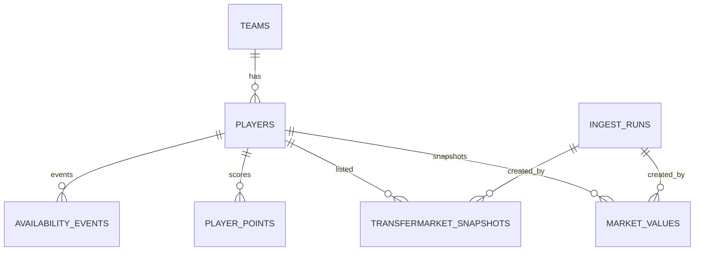

# Datenmodell fuer das Comunio-Projekt

## 1. Modellierungsziele
Das Datenmodell ist auf folgende Kernziele optimiert:

- Historisierung von Marktwerten und Transfermarkt-Ereignissen
- Eindeutige Spieleridentifikation ueber Comunio-IDs
- Idempotente taegliche Snapshots ohne Duplikate
- Performante Auswertung fuer Dashboard und Rankings

## 2. Fachliches ER-Modell

## 3. Tabellen und Felder

### 3.1 teams
Stammdaten zu Teams.

| Feld | Typ | Constraint | Beschreibung |
|------|-----|------------|--------------|
| id | BIGSERIAL | PK | Interner Schluessel |
| comunio_team_id | BIGINT | UNIQUE NOT NULL | Team-ID aus Quelle |
| name | TEXT | NOT NULL | Teamname |
| league | TEXT | NULL | Liga/Community |
| season | TEXT | NULL | Saisonkennung |
| created_at | TIMESTAMPTZ | NOT NULL DEFAULT now() | Erstellzeit |
| updated_at | TIMESTAMPTZ | NOT NULL DEFAULT now() | Letzte Aenderung |

### 3.2 players
Spieler-Stammdaten inkl. aktueller Teamzuordnung.

| Feld | Typ | Constraint | Beschreibung |
|------|-----|------------|--------------|
| id | BIGSERIAL | PK | Interner Schluessel |
| comunio_player_id | BIGINT | UNIQUE NOT NULL | Eindeutige Spieler-ID |
| name | TEXT | NOT NULL | Spielername |
| position | TEXT | NOT NULL CHECK position IN ('TW','ABW','MITT','ST') | Position |
| team_id | BIGINT | FK teams(id) | Aktuelles Team |
| source | TEXT | NOT NULL DEFAULT 'comuniopy' | Datenherkunft |
| first_seen_at | TIMESTAMPTZ | NOT NULL DEFAULT now() | Erstsichtung |
| last_seen_at | TIMESTAMPTZ | NOT NULL DEFAULT now() | Letzte Sichtung |
| created_at | TIMESTAMPTZ | NOT NULL DEFAULT now() | Erstellzeit |
| updated_at | TIMESTAMPTZ | NOT NULL DEFAULT now() | Letzte Aenderung |

### 3.3 ingest_runs
Metadaten zu jedem Ingest-Lauf.

| Feld | Typ | Constraint | Beschreibung |
|------|-----|------------|--------------|
| id | BIGSERIAL | PK | Lauf-ID |
| run_type | TEXT | NOT NULL | manual oder scheduled |
| status | TEXT | NOT NULL | started, success, failed |
| started_at | TIMESTAMPTZ | NOT NULL | Startzeitpunkt |
| finished_at | TIMESTAMPTZ | NULL | Endzeitpunkt |
| records_written | INTEGER | NOT NULL DEFAULT 0 | Anzahl Datensaetze |
| error_message | TEXT | NULL | Fehlertext |

### 3.4 market_values
Zeitreihe der Marktwerte je Spieler.

| Feld | Typ | Constraint | Beschreibung |
|------|-----|------------|--------------|
| id | BIGSERIAL | PK | Interner Schluessel |
| player_id | BIGINT | FK players(id) NOT NULL | Spieler |
| snapshot_date | DATE | NOT NULL | Fachlicher Snapshot-Tag |
| captured_at | TIMESTAMPTZ | NOT NULL | Technischer Erfassungszeitpunkt |
| value_eur | BIGINT | NOT NULL CHECK value_eur >= 0 | Marktwert in EUR |
| source | TEXT | NOT NULL DEFAULT 'comuniopy' | Herkunft |
| ingest_run_id | BIGINT | FK ingest_runs(id) | Laufreferenz |

Idempotenz-Constraint:
- UNIQUE (player_id, snapshot_date)

### 3.5 player_points
Punkte je Spieler und Spieltag.

| Feld | Typ | Constraint | Beschreibung |
|------|-----|------------|--------------|
| id | BIGSERIAL | PK | Interner Schluessel |
| player_id | BIGINT | FK players(id) NOT NULL | Spieler |
| season | TEXT | NOT NULL | Saison |
| matchday | INTEGER | NOT NULL CHECK matchday > 0 | Spieltag |
| points | INTEGER | NOT NULL | Punkte |
| captured_at | TIMESTAMPTZ | NOT NULL DEFAULT now() | Erfassungszeit |
| source | TEXT | NOT NULL DEFAULT 'comuniopy' | Herkunft |

Eindeutigkeit:
- UNIQUE (player_id, season, matchday)

### 3.6 transfermarket_snapshots
Transfermarktstatus je Spieler zum Snapshot-Zeitpunkt.

| Feld | Typ | Constraint | Beschreibung |
|------|-----|------------|--------------|
| id | BIGSERIAL | PK | Interner Schluessel |
| player_id | BIGINT | FK players(id) NOT NULL | Spieler |
| snapshot_date | DATE | NOT NULL | Fachlicher Snapshot-Tag |
| captured_at | TIMESTAMPTZ | NOT NULL | Erfassungszeitpunkt |
| listed | BOOLEAN | NOT NULL | Auf Transfermarkt |
| price_eur | BIGINT | NULL CHECK price_eur >= 0 | Angebotspreis |
| owner_name | TEXT | NULL | Besitzername |
| ingest_run_id | BIGINT | FK ingest_runs(id) | Laufreferenz |

Idempotenz-Constraint:
- UNIQUE (player_id, snapshot_date)

### 3.7 availability_events
Event-Log fuer Verfuegbarkeitsveraenderungen.

| Feld | Typ | Constraint | Beschreibung |
|------|-----|------------|--------------|
| id | BIGSERIAL | PK | Event-ID |
| player_id | BIGINT | FK players(id) NOT NULL | Spieler |
| event_type | TEXT | NOT NULL | listed, sold, assigned_team |
| event_at | TIMESTAMPTZ | NOT NULL | Ereigniszeit |
| payload | JSONB | NULL | Zusatzdetails |

### 3.8 audit_log
Audit-Trail fuer relevante Datenaenderungen.

| Feld | Typ | Constraint | Beschreibung |
|------|-----|------------|--------------|
| id | BIGSERIAL | PK | Audit-ID |
| table_name | TEXT | NOT NULL | Betroffene Tabelle |
| operation | TEXT | NOT NULL | INSERT, UPDATE, DELETE |
| record_id | BIGINT | NOT NULL | Schluessel des Datensatzes |
| old_value | JSONB | NULL | Alter Zustand |
| new_value | JSONB | NULL | Neuer Zustand |
| changed_by | TEXT | NOT NULL DEFAULT 'system' | Aenderungsquelle |
| changed_at | TIMESTAMPTZ | NOT NULL DEFAULT now() | Zeitpunkt |

## 4. Abgeleitete Kennzahlen

Die folgenden Kennzahlen werden in der API berechnet (nicht redundant persistiert):

- Delta Vortag: value_today - value_yesterday
- Delta Erstwert: value_today - value_first_snapshot
- Prozentdelta: (value_today - value_reference) / value_reference * 100
- Ranking-Score, z. B. Wertsteigerung pro Tag

Regel fuer fehlende Referenzwerte:
- Kein Referenzwert vorhanden fuehrt zu NULL in Delta-Feldern.

## 5. Indizes

Empfohlene Indizes:

- players(comunio_player_id)
- players(team_id)
- market_values(player_id, snapshot_date DESC)
- market_values(snapshot_date)
- player_points(player_id, season, matchday)
- transfermarket_snapshots(player_id, snapshot_date DESC)
- availability_events(player_id, event_at DESC)
- audit_log(table_name, changed_at DESC)
- audit_log(record_id)

## 6. Partitionierung und Zeitreihen

Bei groesserer Datenmenge:

- market_values monatlich oder quartalsweise partitionieren
- transfermarket_snapshots monatlich oder quartalsweise partitionieren
- Optional TimescaleDB-Hypertables fuer beide Snapshot-Tabellen

## 7. Datenqualitaetsregeln

- Snapshot pro Spieler und Tag nur einmal zulassen
- Kein negativer Marktwert oder Preis
- Positionswerte auf festes Enum begrenzen
- Ingest-Run muss bei Writes referenzierbar sein
- Source-Feld fuer Herkunftstransparenz pflegen

## 8. Audit- und Aufbewahrungsregeln

- Audit-Trigger fuer UPDATE und DELETE auf players, market_values und transfermarket_snapshots.
- Retention:
	- audit_log: mindestens 1 Jahr.
	- ingest- und API-Logdaten: mindestens 90 Tage.
- Verschluesselung at rest fuer DB und Backups ist verpflichtend.

## 9. Phase-1 Scope (Analyse und Setup)

### 9.1 Tabellenfokus fuer Phase 1
Pflicht fuer Abnahme Phase 1:
- teams
- players
- ingest_runs
- market_values

Kann fuer spaetere Umsetzung vorbereitet, aber nicht voll ausgebaut werden:
- player_points
- transfermarket_snapshots
- availability_events
- audit_log

### 9.2 Phase-1 Mindestregeln
- Idempotenzregel fuer market_values ist verbindlich: UNIQUE (player_id, snapshot_date).
- Primär- und Fremdschluesselbeziehungen fuer Kernfluesse sind in der Spezifikation fixiert.
- Indizes fuer Kernabfragen sind als Mindestset definiert und dokumentiert.

### 9.3 Trade-offs (nur Phase 1)
- Schema-Stabilitaet vor Vollstaendigkeit: erst Kernobjekte absichern, dann Erweiterungen.
- Keine vorgezogene Optimierung: Partitionierung und Advanced-Tuning erst nach Messwerten.

### 9.4 Offene Entscheidungen aus Phase 1
- Exakte Retention-Strategie pro fachlicher Tabelle (über Mindestregeln hinaus).
- Zeitpunkt fuer produktive Aktivierung erweiterter Audit-Trails.

## 10. AP-6 Umsetzung: Migrationen und Tabellenschnitt

Die AP-6 Umsetzung ist als drei SQL-Migrationen plus Runner umgesetzt:

- 001_core_tables.sql
	- teams
	- players
	- ingest_runs
- 002_timeseries_tables.sql
	- market_values
	- player_points
	- transfermarket_snapshots
- 003_events_audit_tables.sql
	- availability_events
	- audit_log

### 10.1 Technische Absicherung
- Die Migrationen sind auf wiederholte Ausfuehrung ausgelegt (CREATE TABLE IF NOT EXISTS).
- Fortschritt wird in schema_migrations nachgehalten.
- AP-6 deckt die Persistenzgrundlage ab, nicht die fachliche Befuellung.

### 10.2 Idempotenz-Mechanik
- market_values: UNIQUE (player_id, snapshot_date)
- transfermarket_snapshots: UNIQUE (player_id, snapshot_date)
- player_points: UNIQUE (player_id, season, matchday)

Diese Constraints sind die Basis fuer doppelsichere Wiederholungsläufe in AP-7.

## 11. AP-7 Write-Pfad (manueller Snapshot-Job)

AP-7 nutzt folgende Persistenz-Reihenfolge:

1. ingest_runs als Start-Eintrag anlegen (status=started)
2. teams upsert
3. players upsert
4. market_values upsert mit ingest_run_id
5. ingest_runs auf success oder failed abschliessen

### 11.1 Idempotenz im Lauf
- Marktwert-Snapshots werden pro Spieler/Tag eindeutig gehalten.
- Wiederholte Runs aktualisieren bestehende Tageswerte statt Duplikate zu erzeugen.

### 11.2 Fehlerverhalten
- Bei Fehlern in der Write-Phase wird die aktive Transaktion zurueckgerollt.
- Laufstatus wird als failed inkl. Fehlermeldung in ingest_runs dokumentiert.

