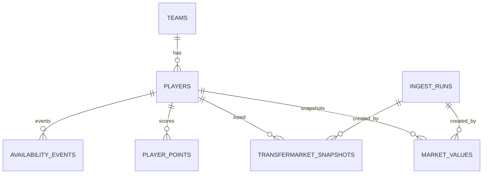

# Datenmodell fuer das Comunio-Projekt

## 1. Modellierungsziele

Das Datenmodell ist auf folgende Kernziele optimiert:

- Historisierung von Marktwerten und Transfermarkt-Ereignissen
- Eindeutige Spieleridentifikation ueber Comunio-IDs
- Idempotente taegliche Snapshots ohne Duplikate
- Performante Auswertung fuer Dashboard und Rankings

## 2. Fachliches ER-Modell

## 3. Tabellen und Felder

### 3.1 teams

Stammdaten zu Teams.

| Feld            | Typ         | Constraint             | Beschreibung        |
| --------------- | ----------- | ---------------------- | ------------------- |
| id              | BIGSERIAL   | PK                     | Interner Schluessel |
| comunio_team_id | BIGINT      | UNIQUE NOT NULL        | Team-ID aus Quelle  |
| name            | TEXT        | NOT NULL               | Teamname            |
| league          | TEXT        | NULL                   | Liga/Community      |
| season          | TEXT        | NULL                   | Saisonkennung       |
| created_at      | TIMESTAMPTZ | NOT NULL DEFAULT now() | Erstellzeit         |
| updated_at      | TIMESTAMPTZ | NOT NULL DEFAULT now() | Letzte Aenderung    |

### 3.2 players

Spieler-Stammdaten inkl. aktueller Teamzuordnung.

| Feld              | Typ         | Constraint                                          | Beschreibung          |
| ----------------- | ----------- | --------------------------------------------------- | --------------------- |
| id                | BIGSERIAL   | PK                                                  | Interner Schluessel   |
| comunio_player_id | BIGINT      | UNIQUE NOT NULL                                     | Eindeutige Spieler-ID |
| name              | TEXT        | NOT NULL                                            | Spielername           |
| position          | TEXT        | NOT NULL CHECK position IN ('TW','ABW','MITT','ST') | Position              |
| team_id           | BIGINT      | FK teams(id)                                        | Aktuelles Team        |
| source            | TEXT        | NOT NULL DEFAULT 'comuniopy'                        | Datenherkunft         |
| first_seen_at     | TIMESTAMPTZ | NOT NULL DEFAULT now()                              | Erstsichtung          |
| last_seen_at      | TIMESTAMPTZ | NOT NULL DEFAULT now()                              | Letzte Sichtung       |
| created_at        | TIMESTAMPTZ | NOT NULL DEFAULT now()                              | Erstellzeit           |
| updated_at        | TIMESTAMPTZ | NOT NULL DEFAULT now()                              | Letzte Aenderung      |

### 3.3 ingest_runs

Metadaten zu jedem Ingest-Lauf.

| Feld             | Typ         | Constraint         | Beschreibung                              |
| ---------------- | ----------- | ------------------ | ----------------------------------------- |
| id               | BIGSERIAL   | PK                 | Lauf-ID                                   |
| run_type         | TEXT        | NOT NULL           | manual oder scheduled (EventBridge)       |
| status           | TEXT        | NOT NULL           | started, success, failed                  |
| started_at       | TIMESTAMPTZ | NOT NULL           | Startzeitpunkt                            |
| finished_at      | TIMESTAMPTZ | NULL               | Endzeitpunkt                              |
| records_written  | INTEGER     | NOT NULL DEFAULT 0 | Anzahl Datensaetze                        |
| error_message    | TEXT        | NULL               | Fehlertext                                |
| error_code       | TEXT        | NULL               | Sanitizter Fehlercode statt Roh-Exception |
| correlation_id   | TEXT        | NULL               | Korrelation fuer Run/Logs/Audit           |
| gate_status      | TEXT        | NULL               | Status der Security-Gates S1-S4           |
| remediation_step | TEXT        | NULL               | Zuordnung zum Remediation-Schritt         |

AP-9-Regeln fuer `ingest_runs`:

- Ein EventBridge-Lauf wird mit `run_type=scheduled` gekennzeichnet; manuelle Recovery-Laeufe bleiben `manual`.
- Jeder Lauf wird unabhaengig protokolliert. Wiederholungen duerfen den fachlichen Snapshot nicht duplizieren, weil die bestehenden UNIQUE-Constraints auf den Snapshot-Tabellen unveraendert gelten.
- Scheduler- und DLQ-Metadaten werden in EventBridge, ECS und CloudWatch auditiert und nicht als neue fachliche Tabellen modelliert.

### 3.4 market_values

Zeitreihe der Marktwerte je Spieler.

| Feld          | Typ         | Constraint                    | Beschreibung                    |
| ------------- | ----------- | ----------------------------- | ------------------------------- |
| id            | BIGSERIAL   | PK                            | Interner Schluessel             |
| player_id     | BIGINT      | FK players(id) NOT NULL       | Spieler                         |
| snapshot_date | DATE        | NOT NULL                      | Fachlicher Snapshot-Tag         |
| captured_at   | TIMESTAMPTZ | NOT NULL                      | Technischer Erfassungszeitpunkt |
| value_eur     | BIGINT      | NOT NULL CHECK value_eur >= 0 | Marktwert in EUR                |
| source        | TEXT        | NOT NULL DEFAULT 'comuniopy'  | Herkunft                        |
| ingest_run_id | BIGINT      | FK ingest_runs(id)            | Laufreferenz                    |

Idempotenz-Constraint:

- UNIQUE (player_id, snapshot_date)

### 3.5 player_points

Punkte je Spieler und Spieltag.

| Feld        | Typ         | Constraint                   | Beschreibung        |
| ----------- | ----------- | ---------------------------- | ------------------- |
| id          | BIGSERIAL   | PK                           | Interner Schluessel |
| player_id   | BIGINT      | FK players(id) NOT NULL      | Spieler             |
| season      | TEXT        | NOT NULL                     | Saison              |
| matchday    | INTEGER     | NOT NULL CHECK matchday > 0  | Spieltag            |
| points      | INTEGER     | NOT NULL                     | Punkte              |
| captured_at | TIMESTAMPTZ | NOT NULL DEFAULT now()       | Erfassungszeit      |
| source      | TEXT        | NOT NULL DEFAULT 'comuniopy' | Herkunft            |

Eindeutigkeit:

- UNIQUE (player_id, season, matchday)

### 3.6 transfermarket_snapshots

Transfermarktstatus je Spieler zum Snapshot-Zeitpunkt.

| Feld          | Typ         | Constraint                | Beschreibung            |
| ------------- | ----------- | ------------------------- | ----------------------- |
| id            | BIGSERIAL   | PK                        | Interner Schluessel     |
| player_id     | BIGINT      | FK players(id) NOT NULL   | Spieler                 |
| snapshot_date | DATE        | NOT NULL                  | Fachlicher Snapshot-Tag |
| captured_at   | TIMESTAMPTZ | NOT NULL                  | Erfassungszeitpunkt     |
| listed        | BOOLEAN     | NOT NULL                  | Auf Transfermarkt       |
| price_eur     | BIGINT      | NULL CHECK price_eur >= 0 | Angebotspreis           |
| owner_name    | TEXT        | NULL                      | Besitzername            |
| ingest_run_id | BIGINT      | FK ingest_runs(id)        | Laufreferenz            |

Idempotenz-Constraint:

- UNIQUE (player_id, snapshot_date)

### 3.7 availability_events

Event-Log fuer Verfuegbarkeitsveraenderungen.

| Feld       | Typ         | Constraint              | Beschreibung                |
| ---------- | ----------- | ----------------------- | --------------------------- |
| id         | BIGSERIAL   | PK                      | Event-ID                    |
| player_id  | BIGINT      | FK players(id) NOT NULL | Spieler                     |
| event_type | TEXT        | NOT NULL                | listed, sold, assigned_team |
| event_at   | TIMESTAMPTZ | NOT NULL                | Ereigniszeit                |
| payload    | JSONB       | NULL                    | Zusatzdetails               |

### 3.8 audit_log

Audit-Trail fuer relevante Datenaenderungen.

| Feld       | Typ         | Constraint                | Beschreibung               |
| ---------- | ----------- | ------------------------- | -------------------------- |
| id         | BIGSERIAL   | PK                        | Audit-ID                   |
| table_name | TEXT        | NOT NULL                  | Betroffene Tabelle         |
| operation  | TEXT        | NOT NULL                  | INSERT, UPDATE, DELETE     |
| record_id  | BIGINT      | NOT NULL                  | Schluessel des Datensatzes |
| old_value  | JSONB       | NULL                      | Alter Zustand              |
| new_value  | JSONB       | NULL                      | Neuer Zustand              |
| changed_by | TEXT        | NOT NULL DEFAULT 'system' | Aenderungsquelle           |
| changed_at | TIMESTAMPTZ | NOT NULL DEFAULT now()    | Zeitpunkt                  |

## 4. Abgeleitete Kennzahlen

Die folgenden Kennzahlen werden fuer `GET /api/v1/players/{id}/history` zur Laufzeit berechnet und nicht redundant persistiert:

- `delta_previous_day_eur = value_eur - previous_value_eur`, wobei `previous_value_eur` ausschliesslich vom exakten Kalendertag `snapshot_date - 1 day` stammt.
- `delta_first_eur = value_eur - first_value_eur`, wobei `first_value_eur` der chronologisch erste Snapshot des Spielers ueber die gesamte Historie ist.
- `percent_delta_previous_day = delta_previous_day_eur / previous_value_eur * 100`.
- `percent_delta_first = delta_first_eur / first_value_eur * 100`.

Verbindliche Regeln:

- Fehlt der exakte Kalendertag, sind Referenzdatum, Referenzwert, Vortagsdelta und Vortagsprozentwert `NULL`.
- Beim ersten vorhandenen Snapshot ist `delta_first_eur = 0`; `percent_delta_first` ist `NULL`, wenn der Erstwert `0` ist.
- Bei einem Referenzwert `0` ist der jeweilige Prozentwert `NULL`; es gibt keine Division durch null und keinen Ersatzwert `0`.
- Negative Deltas und Prozentwerte sind gueltige Ergebnisse, obwohl `market_values.value_eur` selbst nicht negativ sein darf.
- Die Berechnung erfolgt vor Zeitraumfilter und Pagination. `captured_at` ist keine fachliche Vergleichsachse.
- Die Projektion verwendet PostgreSQL-Fensterfunktionen; eine neue Tabelle oder Migration ist fuer AP-12 nicht erforderlich.

## 5. Indizes

### 5.1 AP-13 Integrations- und Benchmarkmodell

- AP-13 verwendet eine isolierte PostgreSQL-16-Testdatenbank und die produktiven Migrationen; es werden keine Benchmark-Spalten oder Fachtabellen eingefuehrt.
- Die Fixtures pruefen Teams, Spieler ohne Historie, taegliche Marktwerte, absichtliche Kalendertagsluecken, Marktwert `0`, positive und negative Deltas sowie Transfermarktzeilen ohne Personenbezug.
- Die Integrationsabnahme prueft `UNIQUE (player_id, snapshot_date)`, Fremdschluessel, `value_eur >= 0` und die vorhandenen History-/Transfermarkt-Indizes.
- AP-12 bleibt eine read-only-Projektion aus `market_values`. Query-Plaene und P95-Werte werden als technische Testartefakte ausserhalb des fachlichen Datenmodells gespeichert.
- Ein Spieler ohne Marktwerte ist zulaessig; fehlende Kalendertage erzeugen keine kuenstlichen Snapshot-Zeilen. Negative Deltas sind zulaessig, negative persistierte Marktwerte nicht.

### 5.2 Produktionsindizes fuer AP-13

- `market_values(player_id, snapshot_date DESC)` ist die Baseline fuer History und AP-12-Referenzen.
- `market_values(snapshot_date DESC)` unterstuetzt Datums- und Latest-Snapshot-Abfragen.
- `transfermarket_snapshots(player_id, snapshot_date DESC)` wird fuer Transfermarkt-History verwendet; die Standardabfrage nach Snapshot-Tag bleibt Bestandteil der Baseline-Messung.
- Zusätzliche Indizes, Caching oder materialisierte Projektionen werden erst nach `EXPLAIN (ANALYZE, BUFFERS)` und reproduzierbarer P95-Messung eingefuehrt.

## 5. API-Lesevertraege fuer AP-11

Die AP-11-API liest ausschliesslich aus den fachlichen Snapshot-Tabellen. Sie schreibt keine Fachdaten und verwendet einen separaten PostgreSQL-Read-only-User mit einem eigenen Secrets-Manager-Secret. Der Ingest-User bleibt schreibberechtigt; die beiden DSNs und ECS-Task-Rollen werden nicht geteilt.

| API-Bereich   | Tabellen                                                | Vertrag                                                                                  |
| ------------- | ------------------------------------------------------- | ---------------------------------------------------------------------------------------- |
| Spieler       | `players`, `teams`, letzter Eintrag aus `market_values` | Filter nach Team, Position und Name; stabile Sortierung nach Name und ID                 |
| Teams         | `teams`, `players`                                      | Filter nach Liga und Saison; `player_count` als Aggregat                                 |
| Historie      | `market_values`                                         | Filter nach Spieler und Zeitraum; Sortierung nach `snapshot_date DESC`                   |
| Transfermarkt | `transfermarket_snapshots`, `players`, `teams`          | Standard ist der neueste vorhandene Snapshot-Tag; leere Tabelle liefert eine leere Seite |

Verbindliche API-Regeln:

- Listen-Endpunkte begrenzen `limit` auf maximal 100 und liefern `items`, `limit`, `offset` und `total`.
- Unbekannte Einzelressourcen liefern 404; leere Historien liefern 200 mit leerer `items`-Liste.
- Snapshot-Tage werden als `YYYY-MM-DD`, technische Zeitpunkte als ISO-8601 ausgegeben.
- Deltas werden nicht redundant gespeichert. AP-12 liefert die Rohhistorie mit additiven Feldern fuer Referenzdatum, Referenzwert, absolute und prozentuale Deltas.
- Die neuen Referenz- und Delta-Felder sind bei fehlenden oder ungueltigen Referenzen nullable; bestehende Rohwertfelder und HTTP-Fehlerverhalten bleiben unveraendert.
- `owner_name` aus dem Transfermarkt ist potenziell personenbezogen und darf erst nach einer fachlichen Freigabe oeffentlich verwendet werden.
- Die aktuelle Ingest-Pipeline befuellt `transfermarket_snapshots` noch nicht. Der AP-11-Endpunkt liefert bis zur Ingest-Erweiterung einen validen leeren Datensatz statt fingierter Daten.

Empfohlene Indizes:

- players(comunio_player_id)
- players(team_id)
- market_values(player_id, snapshot_date DESC)
- market_values(snapshot_date)
- player_points(player_id, season, matchday)
- transfermarket_snapshots(player_id, snapshot_date DESC)
- availability_events(player_id, event_at DESC)
- audit_log(table_name, changed_at DESC)
- audit_log(record_id)

## 6. Partitionierung und Zeitreihen

Bei groesserer Datenmenge:

- market_values monatlich oder quartalsweise partitionieren
- transfermarket_snapshots monatlich oder quartalsweise partitionieren
- Optional TimescaleDB-Hypertables fuer beide Snapshot-Tabellen

## 7. Datenqualitaetsregeln

- Snapshot pro Spieler und Tag nur einmal zulassen
- Kein negativer Marktwert oder Preis
- Positionswerte auf festes Enum begrenzen
- Ingest-Run muss bei Writes referenzierbar sein
- Source-Feld fuer Herkunftstransparenz pflegen
- In Produktion ist als Credential-Quelle nur Secrets Manager zulaessig.
- Snapshot-Dateiinput darf nur aus erlaubtem Basisverzeichnis und unter Groessenlimit geladen werden.

## 8. Audit- und Aufbewahrungsregeln

- Audit-Trigger fuer UPDATE und DELETE auf players, market_values und transfermarket_snapshots.
- Retention:
  - audit_log: mindestens 1 Jahr.
  - ingest- und API-Logdaten: mindestens 90 Tage.
- Verschluesselung at rest fuer DB und Backups ist verpflichtend.
- Security-Ereignisse verwenden sanitizte Fehlertaxonomie statt roher Exception-Nachrichten.
- Security- und Incident-Logs mindestens 180 Tage online verfuegbar, danach archiviert.

### 8.1 Grenze zwischen Fachdaten und Betriebsdaten

- Secret-Werte, Passwoerter, Tokens und Secret-Versionen gehoeren nicht in PostgreSQL.
- `ingest_runs.error_message` darf nur eine kurze, sanitizte Diagnose enthalten; der maschinenlesbare `error_code` ist fuer Auswertung und Alerting massgeblich.
- Secret-Zugriffe, Rotationen und Terraform-State-Aenderungen werden ausserhalb des Fachdatenmodells ueber Secrets Manager, CloudTrail und den gesicherten Terraform-State auditiert.
- Ein spaeterer technischer Security-Audit-Store ist nur bei nachgewiesenem Compliance-Bedarf zu ergaenzen und darf keine Secret-Werte persistieren.

### 8.2 Datenmodell-Gates fuer Produktion

- G1: Jeder produktive Ingest-Run besitzt eine `correlation_id` und einen abschliessenden Status.
- G2: Fehlerlaeufe verwenden `error_code`; rohe Exception-Texte werden nicht persistiert.
- G3: Snapshot-Input wird vor der Persistenz gegen Schema, Groesse und erlaubten Pfad geprueft.
- G4: Die fachlichen Idempotenz-Constraints bleiben unveraendert; Security-Haertung darf keine Duplikate oder fachliche Historie erzeugen.
- G5: Prod-Deploys erzwingen `COMUNIO_REQUIRE_SECRET_MODE=true` und verbieten ENV-Quellen; Bild- und Deployment-Referenzen muessen immutable sein.
- G6: Der kostenorientierte MVP ist mit `assign_public_ip=true` verifiziert. Der Status fuer optionale private Networking-Haertung wird erst gruen, wenn der ECS-Task ohne Public IP gestartet, der ECR-/Secrets-Manager-Pfad im privaten VPC verifiziert und die DB-Verbindung aus dem Task selbst nachgewiesen wurde.

### 8.3 Operational Release Gate (2026-09-12)

- Der operative Status der AWS-Umgebung ist wie folgt festgelegt:
  1. Option D (MVP Standard mit `assign_public_ip=true` und Egress-Only SG) ist in AWS ausgerollt, via `terraform apply` synchronisiert (`Apply complete!`) und mit `Exit-Code 0` verifiziert.
  1. NAT-Optionen A (`enable_nat_gateway`) und B (`enable_nat_instance`) wurden als schaltbare Terraform-Variablen im Terraform-Code implementiert und im AWS-State synchronisiert.
  1. Der Switch auf `assign_public_ip=false` (Enterprise Private Egress) bleibt schaltbar vorbereitet und wird erst aktiviert, wenn ein NAT Gateway / eine NAT Instance für private Egress freigegeben wird.
- Die fachliche Datenmodell-Validierung bleibt unveraendert; die Runtime-Gates sind technische Betriebsnachweise und werden nicht als fachliche Datenbankdaten gespeichert.
- `ingest_runs` dokumentiert den Laufstatus und `error_code`, aber keine internen AWS-Topologie- oder NAT-Details; diese Informationen verbleiben in CloudWatch, ECR-Logs und Terraform-/AWS-Auditdaten.

## 12. Konsolidierte Multi-Agent-Ergaenzungen

### 12.1 Priorisierte Massnahmen

- P1: Security-Policy-Felder in `ingest_runs` und klare Gate-Nachvollziehbarkeit.
- P2: Erweiterte Auditierbarkeit ueber Korrelation und Fehlertaxonomie.
- P3: Phasengerechte Retention mit Kostenkontrolle (Hot/Archive).

### 12.2 Trade-offs

- Mehr Felder in `ingest_runs` erhoehen Modellkomplexitaet, verbessern aber Incident-Analyse und Compliance-Nachweis.
- Längere Security-Log-Retention erhoeht Speicherkosten, reduziert jedoch forensisches Risiko.

## 9. Phase-1 Scope (Analyse und Setup)

### 9.1 Tabellenfokus fuer Phase 1

Pflicht fuer Abnahme Phase 1:

- teams
- players
- ingest_runs
- market_values

Kann fuer spaetere Umsetzung vorbereitet, aber nicht voll ausgebaut werden:

- player_points
- transfermarket_snapshots
- availability_events
- audit_log

### 9.2 Phase-1 Mindestregeln

- Idempotenzregel fuer market_values ist verbindlich: UNIQUE (player_id, snapshot_date).
- Primär- und Fremdschluesselbeziehungen fuer Kernfluesse sind in der Spezifikation fixiert.
- Indizes fuer Kernabfragen sind als Mindestset definiert und dokumentiert.

### 9.3 Trade-offs (nur Phase 1)

- Schema-Stabilitaet vor Vollstaendigkeit: erst Kernobjekte absichern, dann Erweiterungen.
- Keine vorgezogene Optimierung: Partitionierung und Advanced-Tuning erst nach Messwerten.

### 9.4 Offene Entscheidungen aus Phase 1

- Exakte Retention-Strategie pro fachlicher Tabelle (über Mindestregeln hinaus).
- Zeitpunkt fuer produktive Aktivierung erweiterter Audit-Trails.

## 10. AP-6 Umsetzung: Migrationen und Tabellenschnitt

Die AP-6 Umsetzung ist als drei SQL-Migrationen plus Runner umgesetzt:

- 001_core_tables.sql
  - teams
  - players
  - ingest_runs
- 002_timeseries_tables.sql
  - market_values
  - player_points
  - transfermarket_snapshots
- 003_events_audit_tables.sql
  - availability_events
  - audit_log

### 10.1 Technische Absicherung

- Die Migrationen sind auf wiederholte Ausfuehrung ausgelegt (CREATE TABLE IF NOT EXISTS).
- Fortschritt wird in schema_migrations nachgehalten.
- AP-6 deckt die Persistenzgrundlage ab, nicht die fachliche Befuellung.

### 10.2 Idempotenz-Mechanik

- market_values: UNIQUE (player_id, snapshot_date)
- transfermarket_snapshots: UNIQUE (player_id, snapshot_date)
- player_points: UNIQUE (player_id, season, matchday)

Diese Constraints sind die Basis fuer doppelsichere Wiederholungsläufe in AP-7.

## 11. AP-7 Write-Pfad (manueller Snapshot-Job)

AP-7 nutzt folgende Persistenz-Reihenfolge:

1. ingest_runs als Start-Eintrag anlegen (status=started)
1. teams upsert
1. players upsert
1. market_values upsert mit ingest_run_id
1. ingest_runs auf success oder failed abschliessen

### 11.1 Idempotenz im Lauf

- Marktwert-Snapshots werden pro Spieler/Tag eindeutig gehalten.
- Wiederholte Runs aktualisieren bestehende Tageswerte statt Duplikate zu erzeugen.

### 11.2 Fehlerverhalten

- Bei Fehlern in der Write-Phase wird die aktive Transaktion zurueckgerollt.
- Laufstatus wird als failed inkl. Fehlermeldung in ingest_runs dokumentiert.
